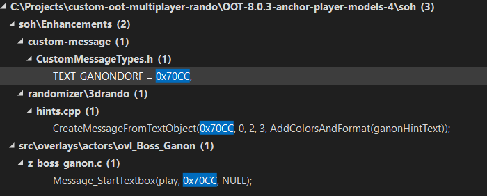
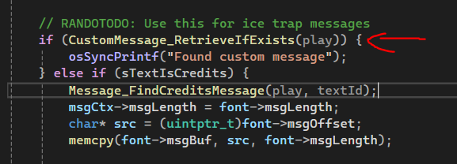
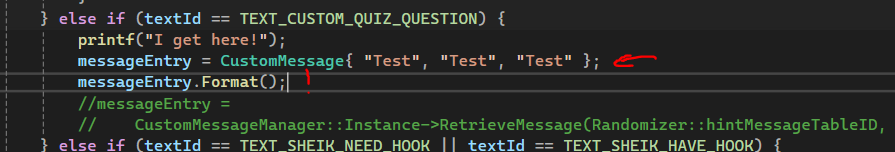
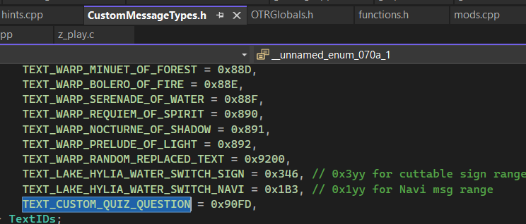
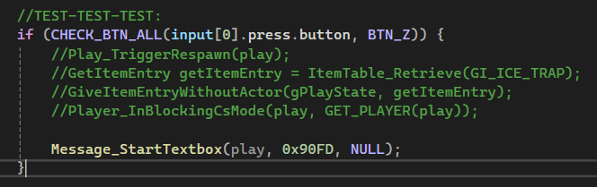

# custom-oot-multiplayer-rando

!Text Data is not extracted yet, but maybe we can just use the CustomMessageManager!

z_message_PAL.c
Functions for Textboxes:

- Message_StartTextbox
- Message_ContinueTextbox

GetItemEntry getItemEntry = ItemTable_Retrieve(GI_ICE_TRAP);

// nice function, but GI_ICE_TRAP only executes when opened from chest
GiveItemEntryWithoutActor(gPlayState, getItemEntry);

// controller button inputs example
if (CHECK_BTN_ALL(input[0].press.button, BTN_Z)) { .. }

Maybe for the quiz we could create a custom actor where we put in all the logic

Side notes:
Otr/o2r are the asset archives with textures, maps, dialogs and stuff

CustomMessageManager.cpp might be useful
z_message_OTR.cpp
Example:

```cpp
CustomMessageManager::Instance->AddCustomMessageTable(customMessageTableID);
    CustomMessageManager::Instance->CreateGetItemMessage(
        customMessageTableID, (GetItemID)TEXT_GS_NO_FREEZE, ITEM_SKULL_TOKEN,
        CustomMessage("You got a %rGold Skulltula Token%w!&You've collected %r{{gsCount}}%w tokens&in total!\x0E\x3C",
                      "Ein %rGoldenes Skulltula-Symbol%w!&Du hast nun insgesamt %r{{gsCount}}&%wGoldene "
                      "Skulltula-Symbole&gesammelt!\x0E\x3C",
                      "Vous obtenez un %rSymbole de&Skulltula d'or%w! Vous avez&collecté %r{{gsCount}}%w symboles en "
                      "tout!\x0E\x3C",
                      TEXTBOX_TYPE_BLUE));
```

void CreateIceTrapRandoMessages() {

// play sound
Audio_PlayFanfare(NA_BGM_SMALL_ITEM_GET);

OTRGlobals.cpp
GetEquipNowMessage

z_message_PAL.c
Found a comment:
// RANDOTODO: Use this for ice trap messages

<br />
Maybe an example how to create custom text and display it:



And we could try to replace the text always at the same textId.
Might be easier if we just want to show the question without dialogue

This in z_message_PAL.c is responsible for loading in custom text:


OTRGlobals.cpp


CustomMessageTypes.h


It could be possible to swap out the messageEntry based on the selected question out of a table.

Start the test textbox:

